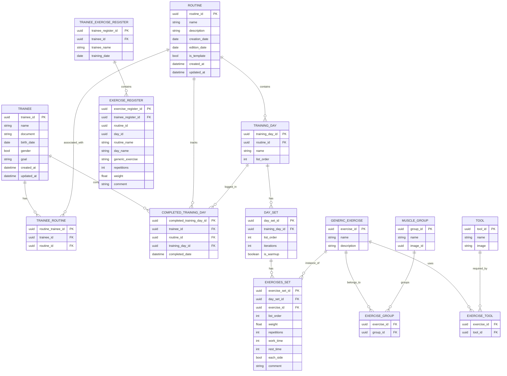

```mermaid
erDiagram
    TRAINEE {
        uuid trainee_id PK
        string name
        string document
        date birth_date
        bool gender
        string goal
        datetime created_at
        datetime updated_at
    }

    ROUTINE {
        uuid routine_id PK
        string name
        string description
        date creation_date
        date edition_date
        bool is_template
        datetime created_at
        datetime updated_at
    }

    TRAINEE_ROUTINE {
        uuid routine_trainee_id PK
        uuid trainee_id FK
        uuid routine_id FK
    }

    TRAINING_DAY {
        uuid training_day_id PK
        uuid routine_id FK
        string name
        int list_order
    }

    COMPLETED_TRAINING_DAY {
        uuid completed_training_day_id PK
        uuid trainee_id FK
        uuid routine_id FK
        uuid training_day_id FK
        datetime completed_date
    }

    DAY_SET {
        uuid day_set_id PK
        uuid training_day_id FK
        int list_order
        int iterations
        boolean is_warmup
    }

    EXERCISES_SET {
        uuid exercise_set_id PK
        uuid day_set_id FK
        uuid exercise_id FK
        int list_order
        float weight
        int repetitions
        int work_time
        int rest_time
        bool each_side
        string comment
    }

    GENERIC_EXERCISE {
        uuid exercise_id PK
        string name
        string description
    }

    MUSCLE_GROUP {
        uuid group_id PK
        string name
        uuid image_id
    }

    EXERCISE_GROUP {
        uuid exercise_id FK
        uuid group_id FK
    }

    TOOL {
        uuid tool_id PK
        string name
        string image
    }

    EXERCISE_TOOL {
        uuid exercise_id FK
        uuid tool_id FK
    }

    TRAINEE_EXERCISE_REGISTER {
        uuid trainee_register_id PK
        uuid trainee_id FK
        string trainee_name
        date training_date
    }

    EXERCISE_REGISTER {
        uuid exercise_register_id PK
        uuid trainee_register_id FK
        uuid routine_id
        uuid day_id
        string routine_name
        string day_name
        string generic_exercise
        int repetitions
        float weight
        string comment
    }

    TRAINEE ||--o{ TRAINEE_ROUTINE : has
    ROUTINE ||--o{ TRAINEE_ROUTINE : associated_with
    ROUTINE ||--o{ TRAINING_DAY : contains
    TRAINING_DAY ||--o{ DAY_SET : has
    DAY_SET ||--o{ EXERCISES_SET : has
    GENERIC_EXERCISE ||--o{ EXERCISES_SET : instance_of
    GENERIC_EXERCISE ||--o{ EXERCISE_GROUP : belongs_to
    MUSCLE_GROUP ||--o{ EXERCISE_GROUP : groups
    GENERIC_EXERCISE ||--o{ EXERCISE_TOOL : uses
    TOOL ||--o{ EXERCISE_TOOL : required_by
    TRAINEE_EXERCISE_REGISTER ||--o{ EXERCISE_REGISTER : contains
    TRAINEE ||--o{ COMPLETED_TRAINING_DAY : completed
    ROUTINE ||--o{ COMPLETED_TRAINING_DAY : tracks
    TRAINING_DAY ||--o{ COMPLETED_TRAINING_DAY : logged_in
```
