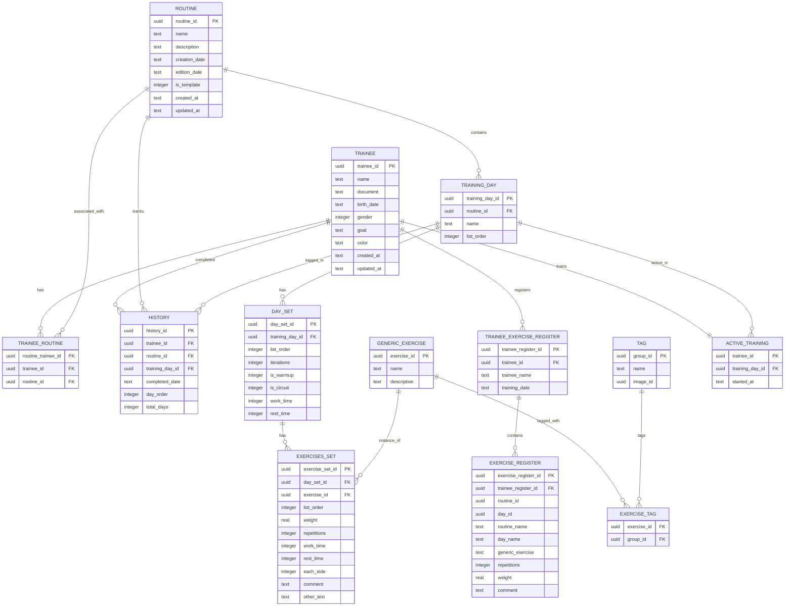

```mermaid
erDiagram
    TRAINEE {
        uuid trainee_id PK
        text name
        text document
        text birth_date
        integer gender
        text goal
        text color
        text created_at
        text updated_at
    }

    ROUTINE {
        uuid routine_id PK
        text name
        text description
        text creation_date
        text edition_date
        integer is_template
        text created_at
        text updated_at
    }

    TRAINEE_ROUTINE {
        uuid routine_trainee_id PK
        uuid trainee_id FK
        uuid routine_id FK
    }

    TRAINING_DAY {
        uuid training_day_id PK
        uuid routine_id FK
        text name
        integer list_order
    }

    HISTORY {
        uuid history_id PK
        uuid trainee_id FK
        uuid routine_id FK
        uuid training_day_id FK
        text completed_date
        integer day_order
        integer total_days
    }

    DAY_SET {
        uuid day_set_id PK
        uuid training_day_id FK
        integer list_order
        integer iterations
        integer is_warmup
        integer is_circuit
        integer work_time
        integer rest_time
    }

    EXERCISES_SET {
        uuid exercise_set_id PK
        uuid day_set_id FK
        uuid exercise_id FK
        integer list_order
        real weight
        integer repetitions
        integer work_time
        integer rest_time
        integer each_side
        text comment
        text other_text
    }

    GENERIC_EXERCISE {
        uuid exercise_id PK
        text name
        text description
    }

    TAG {
        uuid group_id PK
        text name
        uuid image_id
    }

    EXERCISE_TAG {
        uuid exercise_id FK
        uuid group_id FK
    }

    TRAINEE_EXERCISE_REGISTER {
        uuid trainee_register_id PK
        uuid trainee_id FK
        text trainee_name
        text training_date
    }

    EXERCISE_REGISTER {
        uuid exercise_register_id PK
        uuid trainee_register_id FK
        uuid routine_id
        uuid day_id
        text routine_name
        text day_name
        text generic_exercise
        integer repetitions
        real weight
        text comment
    }

    ACTIVE_TRAINING {
        uuid trainee_id PK
        uuid training_day_id FK
        text started_at
    }

    TRAINEE ||--o{ TRAINEE_ROUTINE : has
    ROUTINE ||--o{ TRAINEE_ROUTINE : associated_with
    ROUTINE ||--o{ TRAINING_DAY : contains
    TRAINING_DAY ||--o{ DAY_SET : has
    DAY_SET ||--o{ EXERCISES_SET : has
    GENERIC_EXERCISE ||--o{ EXERCISES_SET : instance_of
    GENERIC_EXERCISE ||--o{ EXERCISE_TAG : tagged_with
    TAG ||--o{ EXERCISE_TAG : tags
    TRAINEE ||--o{ TRAINEE_EXERCISE_REGISTER : registers
    TRAINEE_EXERCISE_REGISTER ||--o{ EXERCISE_REGISTER : contains
    TRAINEE ||--o{ HISTORY : completed
    ROUTINE ||--o{ HISTORY : tracks
    TRAINING_DAY ||--o{ HISTORY : logged_in
    TRAINEE ||--|| ACTIVE_TRAINING : trains
    TRAINING_DAY ||--o{ ACTIVE_TRAINING : active_in
```
